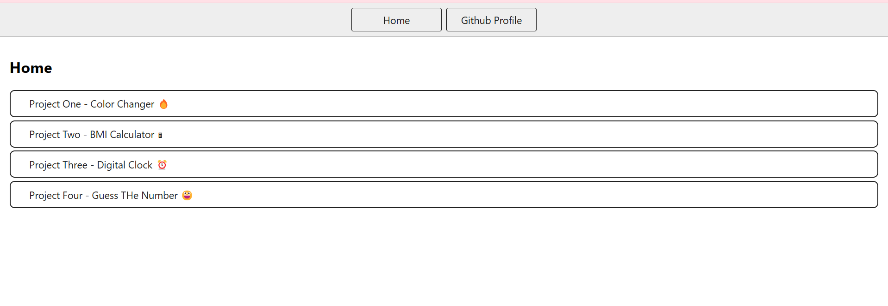
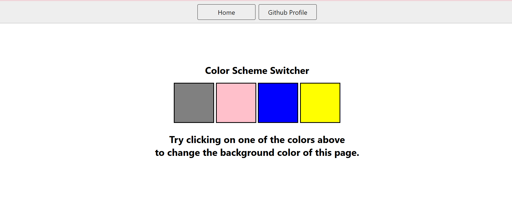
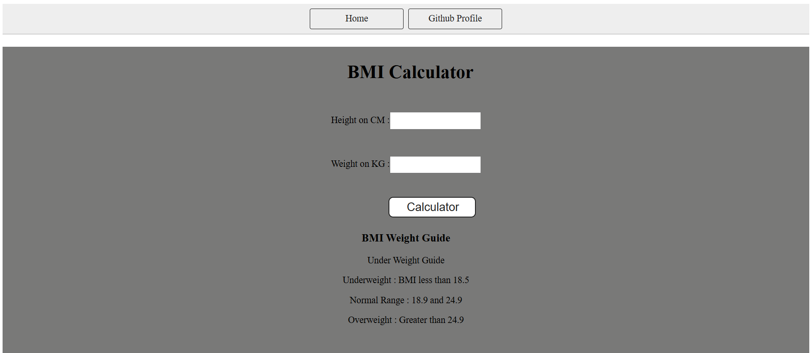
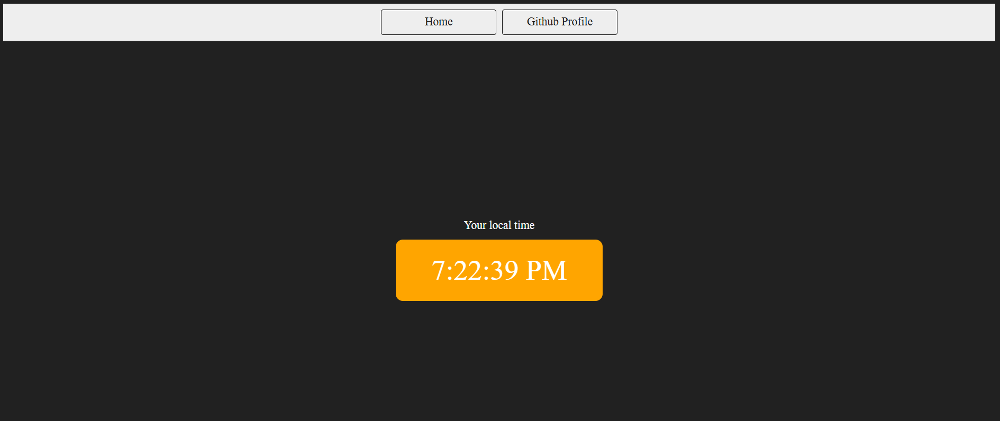

# 🚀 Mini Projects Collection

A simple and clean homepage to showcase a collection of beginner-friendly front-end JavaScript projects.

## 📁 Projects Included

| Project Name                          | Description                              |
|--------------------------------------|------------------------------------------|
| 🔥 [Color Changer](./1-ColorChanger/index.html)        | Changes background color randomly         |
| 🖩 [BMI Calculator](./2-BMICalculator/index.html)       | Calculates BMI based on user input        |
| ⏰ [Digital Clock](./3-DigitalClock/index.html)         | Displays a real-time digital clock        |
| 😀 [Guess The Number](./4-GuessTheNumber/index.html)    | Simple number guessing game               |

---

## 💻 Screenshots
###UI

### Color Changer

### BMI Calculator

### Digital Clock

### Guess The Number

🔗 Or visit my [GitHub Profile](https://github.com/priyankamohole) for updates.

---

